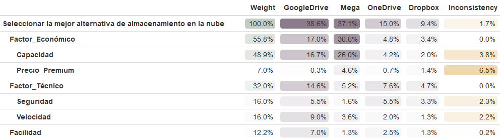
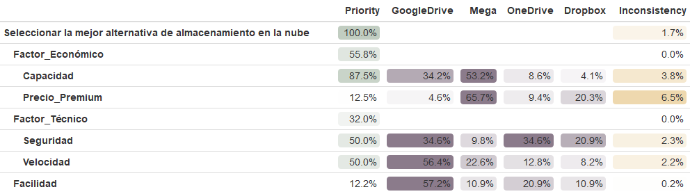

```{r, echo=FALSE}
#install.packages("markdown")
library(markdown)
library(qgraph)
library(ahp)
library(knitr)
library(kableExtra)
library(tibble)
library(formattable)
library(htmltools)
library(webshot)
export_formattable<-function(f,file,width="100%",height=NULL,
                             background="white",delay=0.2)
  {
  w<-formattable::as.htmlwidget(f, width=width,height=height)
  path<-htmltools::html_print(w, background=background,viewer=NULL)
  url<-paste0("file:///",gsub("\\\\","/",normalizePath(path)))
  webshot::webshot(url, file=file, selector=".formattable_widget", delay=delay)
  }

devtools::install_github("calote/ahp")
source("teoriadecision_funciones_multicriterio.R")
source("teoriadecision_funciones_multicriterio_diagram.R") 
source("teoriadecision_funciones_multicriterio_utiles.R")
#install.packages("diagram")
#install.packages("kableExtra")
#install.packages("factoextra")
```

# **1. PLANTEAMIENTO DEL PROBLEMA**

El almacenamiento en la nuve se ha convertido en una herramiente fundamental para los estudiantes, aunque tambien supone uno de los principales problemas a la hora de almacenar archivos debido a la cantidad de espacio gratuito. La eleccion del proveedor adecuado (Google Drive, Mega, DropBox, OneDrive) requiere un buen análisis que va más allá de la capacidad gratuita de estos.

Para la realización de este trabajo vamos a aplicar distintas técnicas de Decisión Multicriterios (AHP, ELECTRE, PROMETHEE) buscando la alternativa óptima para un perfil de usuario académico.

# **2. ALTERNATIVAS Y CRITERIOS**

**Objetivo:** Seleccionar la mejor alternativa de almacenamiento en la nube

```         
1. Google Drive
2. Dropbox
3. OneDrive
4. Mega
```

Donde vamos a emplear los siguientes criterios (y subcriterios)

```         
1. Factor Económico.
- Capacidad Gratuita.
    - DESCRIPCIÓN: GB disponibles sin necesidad de pagar, es decir,
      gratuitos.
    - OBJETIVO: Maximizar. Un mayor número de GB sin coste es más
      ventajoso.

- Precio del Plan Premium.
    - DESCRIPCIÓN: Costo anual en euros del plan de almacenamiento.
    - OBJETIVO: Minimizar. Se prefiere el plan con el menor coste
      económico.

2. Factor Técnico.
- Seguridad.
    - DESCRIPCIÓN: Nivel de seguridad que ofrece cada alternativa.
    - OBJETIVO: Maximizar. Un número menor indica menor seguridad, y un
      número mayor más confianza y protección.

- Velocidad de sincronización.
    - DESCRIPCIÓN: Puntuamos la rapidez en la que se suben y descargan los
      datos.
    - OBJETIVO: Maximizar. Un valor mas alto indica mayor velocidad, lo
      que deseamos.
  
3. Experiencia de Usuario
- Facilidad de Uso.
    - DESCRIPCIÓN: La calidad de las aplicaciones moviles, la
      sincronización con los sistemas, etc.
    - OBJETIVO: Maximizar. Se prefiere la mayor puntuación para una mejor
      experencia para el usuario. 
```

# **3. MATRIZ DE DECISIÓN**

```{r, echo=FALSE}
Alternativas <- c("Google Drive", "Dropbox", "OneDrive", "Mega")

Criterios <- c("Factor_Económico", "Factor_Técnico", "Experiencia de Usuario")

Subcriterios <- c("Capacidad", 
                  "Precio_Premium", 
                  "Seguridad", 
                  "Velocidad", 
                  "Facilidad")

beneficios_costos <- c(TRUE, FALSE, TRUE, TRUE, TRUE)

matriz_decision = multicriterio.crea.matrizdecision(c(16, 21, 9, 10, 12,  
    1,  10, 8,  6,  7,  
    6,  18, 9,  7,  8,  
    20,  0, 6,  8,  7), numalternativas = 4, numcriterios =5, v.nombresalt = Alternativas, v.nombrescri = Subcriterios)

kable_styling(
  kable(matriz_decision, 
        caption = "Matriz de Decisión (Rendimiento de Alternativas vs. Subcriterios)", 
        digits = 0),
  latex_options = c("striped", "condensed"),
  position = "center"
)
```

# **4. METODO 1: PROCESO ANALÍTICO JERARQUICO**

El método AHP permite estructurar el problema en niveles jerarquicos y obtener los pesos de los cireterios y subcriterios mediante comparaciones por pares (dos a dos)

## **4.1. Ponderaciones de Subcriterios**

### **4.1.1. Matriz de comparacion por pares**

En primer lugar vamos a hacer una matriz que contenga la información al comparar los distintos ***criterios***:

```{r, echo=FALSE}
comparaciones = c(7, 1, 5, 3, 1/9, 1/5, 1/7, 5, 1, 1/3)

matrizCriterios = multicriterio.crea.matrizvaloraciones_mej(
  comparaciones, 
  numalternativas = 5,
  v.nombres.alternativas = Subcriterios # Se usan los 5 subcriterios
)


kable_styling(
  kable(matrizCriterios, 
        caption = "Matriz de Comparación de Subcriterios (AHP)", 
        digits = 3),
  latex_options = c("striped", "condensed", "scale_down"),
  position = "center"
)

```

Ahora se hará una matriz para cada uno de los criterios haciendo comparaciones dos a dos sobre las distintas alternativas y ver cual es preferible a cual, buscando siempre respetar la relación de coherencia.

```{r,echo=FALSE}

# 1. C1: Capacidad 
tabC1_Capacidad = multicriterio.crea.matrizvaloraciones_mej(
  c(9, 5, 1/2, 1/3, 1/9, 1/7), 
  numalternativas = 4, v.nombres.alternativas = Alternativas
)

# 2. C2: Precio_Premium 
tabC2_Precio = multicriterio.crea.matrizvaloraciones_mej(
  c(1/5, 1/3, 1/9, 3, 1/5, 1/7), 
  numalternativas = 4, v.nombres.alternativas = Alternativas
)

# 3. C3: Seguridad 
tabC3_Seguridad = multicriterio.crea.matrizvaloraciones_mej(
  c(2, 1, 3, 1/2, 3, 3), 
  numalternativas = 4, v.nombres.alternativas = Alternativas
)

# 4. C4: Velocidad 
tabC4_Velocidad = multicriterio.crea.matrizvaloraciones_mej(
  c(5, 5, 3, 1/2, 1/3, 1/2), 
  numalternativas = 4, v.nombres.alternativas = Alternativas
)

# 5. C5: Facilidad 
tabC5_Facilidad = multicriterio.crea.matrizvaloraciones_mej(
  c(5, 3, 5, 1/2, 1, 2), 
  numalternativas = 4, v.nombres.alternativas = Alternativas
)

```

## **4.2. Ponderaciones de Alternativas**

### MAYOR AUTOVALOR

#### Pesos Locales

Calculamos los pesos locales de las 4 alternativas bajo cada uno de los 5 subcriterios utilizando el metodo del autovector.

```{r,echo=FALSE}
##Para la matriz de criterios
wcriterios = multicriterio.metodoAHP.variante1.autovectormayorautovalor(matrizCriterios)

#1. Para la capacidad
wCapacidad <- multicriterio.metodoAHP.variante1.autovectormayorautovalor(tabC1_Capacidad)

# 2. Para el Precio
wPrecio <- multicriterio.metodoAHP.variante1.autovectormayorautovalor(tabC2_Precio)

# 3. Para la Seguridad
wSeguridad <- multicriterio.metodoAHP.variante1.autovectormayorautovalor(tabC3_Seguridad)

# 4. Para la Velocidad
wVelocidad <- multicriterio.metodoAHP.variante1.autovectormayorautovalor(tabC4_Velocidad)

# 5. Para la Facilidad
wFacilidad <- multicriterio.metodoAHP.variante1.autovectormayorautovalor(tabC5_Facilidad)

#Matriz de Pesos Locales
matrizPesosLocales <- rbind(
  wCapacidad$valoraciones.ahp,
  wPrecio$valoraciones.ahp,
  wSeguridad$valoraciones.ahp,
  wVelocidad$valoraciones.ahp,
  wFacilidad$valoraciones.ahp
)

rownames(matrizPesosLocales) <- Subcriterios

kable_styling(
  kable(matrizPesosLocales, 
        caption = "Pesos Locales por el Metodo Mayor Autovalor de las Alternativas por Subcriterio (AHP)", 
        digits = 3),
  latex_options = c("striped", "condensed"),
  position = "center"
)

```

**Verificando Incosistencia**

```{r, echo=FALSE}
print("Incosistencia Matriz de Criterios:" ); print(wcriterios$consistencia)
print("Inconsistencia C1 (Capacidad):"); print(wCapacidad$consistencia)
print("Inconsistencia C2 (Precio):"); print(wPrecio$consistencia)
print("Inconsistencia C3 (Seguridad):"); print(wSeguridad$consistencia)
print("Inconsistencia C4 (Velocidad):"); print(wVelocidad$consistencia)
print("Inconsistencia C5 (Facilidad):"); print(wFacilidad$consistencia)
```

#### Pesos Globales

```{r, echo=FALSE}
tabla1 = multicriterio.metodoAHP.pesosglobales_entabla(wcriterios$valoraciones.ahp,rbind(wCapacidad$valoraciones.ahp,           wPrecio$valoraciones.ahp, wSeguridad$valoraciones.ahp, wVelocidad$valoraciones.ahp,wFacilidad$valoraciones.ahp))

tabla1 %>%
  kable(booktabs = TRUE) %>%
  kable_styling(latex_options = c("striped", "condensed","HOLD_position", "scale_down"), 
                position = "center",
                full_width = FALSE)
```

### MEDIA GEOMÉTRICA

#### Pesos Locales

```{r, echo=FALSE}
##Para la matriz de criterios
wcriterios2 = multicriterio.metodoAHP.variante2.mediageometrica(matrizCriterios)

#1. Para la capacidad
wCapacidad2 <- multicriterio.metodoAHP.variante2.mediageometrica(tabC1_Capacidad)

# 2. Para el Precio
wPrecio2 <- multicriterio.metodoAHP.variante2.mediageometrica(tabC2_Precio)

# 3. Para la Seguridad
wSeguridad2 <- multicriterio.metodoAHP.variante2.mediageometrica(tabC3_Seguridad)

# 4. Para la Velocidad
wVelocidad2 <- multicriterio.metodoAHP.variante2.mediageometrica(tabC4_Velocidad)

# 5. Para la Facilidad
wFacilidad2 <- multicriterio.metodoAHP.variante2.mediageometrica(tabC5_Facilidad)

#Matriz de Pesos Locales
matrizPesosLocales2 <- rbind(
  wCapacidad2$valoraciones.ahp,
  wPrecio2$valoraciones.ahp,
  wSeguridad2$valoraciones.ahp,
  wVelocidad2$valoraciones.ahp,
  wFacilidad2$valoraciones.ahp
)

rownames(matrizPesosLocales2) <- Subcriterios

kable_styling(
  kable(matrizPesosLocales2, 
        caption = "Pesos Locales por Media Aritmetica de las Alternativas por Subcriterio (AHP)", 
        digits = 3),
  latex_options = c("striped", "condensed"),
  position = "center"
)

```

#### Pesos Globales

```{r, echo=FALSE}
tabla2 = multicriterio.metodoAHP.pesosglobales_entabla(wcriterios2$valoraciones.ahp,rbind(wCapacidad2$valoraciones.ahp,           wPrecio2$valoraciones.ahp, wSeguridad2$valoraciones.ahp, wVelocidad2$valoraciones.ahp,wFacilidad2$valoraciones.ahp))

tabla2 %>%
  kable(booktabs = TRUE) %>%
  kable_styling(latex_options = c("striped", "condensed","HOLD_position", "scale_down"), position = "center", full_width = FALSE)
```

### METODO BÁSICO

#### Pesos Locales

```{r, echo=FALSE}
##Para la matriz de criterios
wcriterios3 = multicriterio.metodoAHP.variante3.basico(matrizCriterios)

#1. Para la capacidad
wCapacidad3 = multicriterio.metodoAHP.variante3.basico(tabC1_Capacidad)

# 2. Para el Precio
wPrecio3 = multicriterio.metodoAHP.variante3.basico(tabC2_Precio)

# 3. Para la Seguridad
wSeguridad3 = multicriterio.metodoAHP.variante3.basico(tabC3_Seguridad)

# 4. Para la Velocidad
wVelocidad3 = multicriterio.metodoAHP.variante3.basico(tabC4_Velocidad)

# 5. Para la Facilidad
wFacilidad3 = multicriterio.metodoAHP.variante3.basico(tabC5_Facilidad)

#Matriz de Pesos Locales
matrizPesosLocales3 <- rbind(
  wCapacidad3$valoraciones.ahp,
  wPrecio3$valoraciones.ahp,
  wSeguridad3$valoraciones.ahp,
  wVelocidad3$valoraciones.ahp,
  wFacilidad3$valoraciones.ahp
)

rownames(matrizPesosLocales3) <- Subcriterios

kable_styling(
  kable(matrizPesosLocales3, 
        caption = "Pesos Locales por el Metodo Basico de las Alternativas por Subcriterio (AHP)", 
        digits = 3),
  latex_options = c("striped", "condensed"),
  position = "center"
)

```

#### Pesos Globales

```{r, echo=FALSE}
tabla3 = multicriterio.metodoAHP.pesosglobales_entabla(wcriterios3$valoraciones.ahp,rbind(wCapacidad3$valoraciones.ahp,           wPrecio3$valoraciones.ahp, wSeguridad3$valoraciones.ahp, wVelocidad3$valoraciones.ahp,wFacilidad3$valoraciones.ahp))

tabla3 %>%
  kable(booktabs = TRUE) %>%
  kable_styling(latex_options = c("striped", "condensed","HOLD_position", "scale_down"), position = "center", full_width = FALSE)
```

## 4.3. Conclusiones

**Conclusión:** Podemos ver que independientemente del método de cálculo de los pesos locales utilizado (Método del Mayor Autovalor, Media Geométrica o Método Básico), la alternativa más óptima para seleccionar es **Google Drive** con un peso global que se mantiene consistentemente alto:

-   **Método del Mayor Autovalor:** **40.24%**

-   **Media Geométrica:** **40.29%**

-   **Método Básico:** **40.18%**

Además, se verifica que para todos los métodos la alternativa menos óptima para seleccionar es **Dropbox**, cuyos ponderadores globales se sitúan consistentemente alrededor del 11.5%.

# **5. METODO 2: Diagrama Jerárquico AHP**

```{r, echo=FALSE}
num.alt = length(Alternativas) 
num.cri = length(Subcriterios)
n.alternativas = Alternativas
n.criterios = Subcriterios

xArray2 = array(NA, dim = c(num.alt, num.alt, num.cri))
xArray2[,,1] <- tabC1_Capacidad
xArray2[,,2] <- tabC2_Precio
xArray2[,,3] <- tabC3_Seguridad
xArray2[,,4] <- tabC4_Velocidad
xArray2[,,5] <- tabC5_Facilidad

dimnames(xArray2)[[1]] = n.alternativas
dimnames(xArray2)[[2]] = n.alternativas
dimnames(xArray2)[[3]] = n.criterios 

paso1 = multicriterio.metodoAHP.variante3.completo(matrizCriterios,xArray2)
sol_m2 = paso1$pesos.globales_entabla

sol_m2 %>%
  kable(booktabs = TRUE) %>%
  kable_styling(latex_options = c("striped", "condensed","HOLD_position", "scale_down"),position = "center",full_width = FALSE)
```

## **Diagrama**

```{r,echo=FALSE}
multicriterio.metodoahp.diagrama(matrizCriterios, xArray2)
```

No se ve de forma muy clara en este diagrama ya que está toda la información muy condensada. Pero puede leerse bajo cada una de las alternativas el peso global que tiene cada una en la decisión final y podemos ver que la mejora más óptima para ser implementada según este método es Google Drive.

## **Implementación AHP con el Paquete "ahp"**

Podemos ver un primer gráfico con forma de árbol que muestra el objetivo que se persigue en este trabajo, los distintos criterios que se tienen en cuenta para tomar esta elección y las distintas alternativas que pueden llevarse a cabo:

```{r,echo=FALSE}
library(ahp)
datos_ahp <- Load("modelo_ahp.ahp")
Calculate(datos_ahp)
```

```{r,echo=FALSE}
Visualize(datos_ahp)
```

### **Contribución** Total

```{r,echo=FALSE}
export_formattable(AnalyzeTable(datos_ahp), file = "tablaahp1.png")

```

### Pesos Locales

```{r,echo=FALSE}
tabla2 = AnalyzeTable(datos_ahp, variable = "priority")
export_formattable(tabla2, file = "tablaahp2.png")

```

### **Análisis de las Tablas AHP:**

#### **Contribución Total de los Criterios**

La primera tabla muestra la contribución total de cada factor en la selección final. El factor con mayor peso es:

**Factor Económico (55.8%):** Es el factor más importante y domina la decisión con un peso global de **55.8%**. En este factor, la alternativa de **Mega** lidera, contribuyendo con el **30.6%** del peso total del Factor Económico para la alternativa final, lo que refleja la relevancia de la Capacidad en la decisión.

De forma similar, puede verse esto para el resto de factores hasta llegar al factor con menor peso que es la **Experiencia de Usuario** con tan solo un **12.2%**.

Los valores de inconsistencia son bajos, siendo el más alto el del subcriterio **Precio_Premium (6.5%)** y la inconsistencia global es solo del **1.7%**. Esto indica que las evaluaciones y comparaciones dentro de cada factor se han hecho de manera coherente.

#### **Pesos Locales por Criterio**

En la segunda tabla , se detallan los pesos locales, que reflejan la importancia de cada alternativa dentro de cada subcriterio específico. Cabe destacar que la opción de **Mega** es la más relevante para el subcriterio Capacidad, con un peso local del **53.2%**.

Fijándonos en el peso, vemos que la implementación de **Google Drive** es la alternativa preferible para minimizar el riesgo, ya que se posiciona como la opción con mayor seguridad y velocidad dentro del **Factor Técnico**, colocándose así con un **34.6%** de peso local en Seguridad (junto a OneDrive) y un **56.4%** de peso local en Velocidad.

### **Conclusión**

Finalmente, se puede concluir de forma general que aplicando el método AHP multinivel, la alternativa de **Mega** es la opción que lidera la prioridad global con un **38.6%**, seguida de cerca por **Google Drive** con un **37.1%**. Por lo tanto, para las prioridades globales, las mejoras deberían enfocarse en **Mega** y **Google Drive**, siendo ambas opciones muy fuertes en el almacenamiento en la nube, aunque Mega sobresale en Capacidad (su mayor fortaleza) y Google Drive en el equilibrio de Seguridad y Velocidad.

# **6. METODO 2: ELECTRE**

El método ELECTRE trata separar el conjunto de todas las alternativas en dos subconjuntos, uno formado por las alternativas mas favorables y otro formado por las peores opciones, y todo ello con ayuda de un grafo. El metodo funciona de forma secuencial, reduciendo el conjunto de alternativas favorables, hasta obtener una sola. Se basa en umbrales de concordancia y discordancia.

```{r,echo=FALSE}
library(qgraph)

W_subcriterios = wcriterios$valoraciones.ahp

concordancia_alpha <- 0.70

#Ahora, definimos los de discordancia, tenemos que darle unos valores a los criterios,

resultado_electre <- multicriterio.metodoELECTRE_I(
  matriz_decision, 
  W_subcriterios, 
  nivel.concordancia.minimo.alpha = concordancia_alpha,
  no.se.compensan = c(600, Inf, 4, Inf, Inf,Inf),
  que.alternativas = T
)

```

#### **Grafo de Sobreclasificación**

```{r,echo=FALSE}
qgraph::qgraph(resultado_electre$relacion.dominante, labels = Alternativas)
```

```{r,echo=FALSE}
resultado_electre$nucleo_aprox
```

## **Conclusión**

Google Drive y Mega forman el Núcleo de alternativas no dominadas. Esto significa que ninguna de las otras es lo suficientemente buena para superarlas bajo los umbrales definidos.

Observamos que Google Drive supera a Dropbox y OneDrive, OneDrive solo supera a Dropbox y Mega está totalmente aislada, esto es debido a que su rendimiento externo y su debilidad extrema hacen que no tenga suficiente concordancia para superar a Google Drive. Es lo suficientemente mala en seguridad para que Google Drive no pueda superarla.

### **Vamos a bajar el nivel de concordancia hasta obtener solo un unico valor en el nucleo:**

```{r,echo=FALSE}

concordancia_alpha <- 0.60

resultado_electre <- multicriterio.metodoELECTRE_I(
  matriz_decision, 
  W_subcriterios, 
  nivel.concordancia.minimo.alpha = concordancia_alpha,
  no.se.compensan = c(600, Inf, 4, Inf, Inf,Inf),
  que.alternativas = c(1,4)
)

```

#### Grafo de Sobrecalificación

```{r,echo=FALSE}
qgraph::qgraph(resultado_electre$relacion.dominante)
```

```{r,echo=FALSE}
resultado_electre$nucleo_aprox
```

Según el método ELECTRE la mejora más óptima es $a_1$ implemnetar un sitema de telemetría. Además pueden ordenarse las alternativas:

```{r,echo=FALSE}
electre = func_ELECTRE_Completo(resultado_electre)
grafo= electre$Grafo
qgraph::qgraph(electre$Grafo)
electre$Nucleo
```

## **Conclusión**

Con el método ELECTRE visto en clase, con los pesos definidos para este metodo (hemos usado los mismos que para el metodo AHP), definiendo un umbral de concordancia del 0.6.

Hemos obtenido el grafico de relaciones. Obersrvando que el núcleo de alternativas es: *Google Drve*. Esto quiere decir que no exite otra alternativa que las domine.

# **7. METODO 3: PROMETHEE**

El metedo Promethee es una tecnica que establece un ranking completo de alternativas transformando la evaluacion de criterios en grados de preferencia (valores entre 0 y 1). Se logra mediante funciones de preferencia utilizando dos umbrales: indiferencia y preferencia. Cuando una alternativa es mejor que otra se mide calculando el flujo neto, diferencia entre el flujo positivo y el flujo negativo, ordenando las alternativas de mayor a menor.

```{r, echo=FALSE}
pesos_promethee <- W_subcriterios

tab.fpref <- matrix(c(
    3, 1, 3, 0, # Capacidad
    5, 1, 3, 0, # Precio_Premium
    2, 1, 3, 0, # Seguridad
    6, 1, 3, 0, # Velocidad
    4, 1, 3, 0  # Facilidad
), ncol = 4, byrow = TRUE)

```

## PROMETHEE I

```{r,echo=FALSE}
tab.Pthee.i = multicriterio.metodo.promethee_i(matriz_decision,pesos_promethee,tab.fpref)
```

```{r,echo=FALSE}
require ("qgraph")
qgraph(tab.Pthee.i$tablarelacionsupera)
```

## PROMETHEE II

```{r,echo=FALSE}
tab.Pthee.ii = multicriterio.metodo.promethee_ii(matriz_decision,pesos_promethee,tab.fpref)
```

```{r,echo=FALSE}
qgraph(tab.Pthee.ii$tablarelacionsupera)
```

## PROMETHEE I (medias)

```{r, echo=TRUE}
tab.Pthee.i_med = multicriterio.metodo.promethee_i_med(matriz_decision,pesos_promethee,tab.fpref)
```

```{r, echo=FALSE}
qgraph(tab.Pthee.i_med$tablarelacionsupera)
```

## PROMETHEE II (medias)

```{r, echo=FALSE}
tab.Pthee.ii_med = multicriterio.metodo.promethee_ii_med(matriz_decision,pesos_promethee,tab.fpref)
```

```{r,echo=FALSE}
qgraph(tab.Pthee.ii_med$tablarelacionsupera)
```

### Comparativa Promethee II: sin medias y con medias

```{r,echo=FALSE}
order(tab.Pthee.ii$vflujos.netos,decreasing = T)
order(tab.Pthee.ii_med$vflujos.netos,decreasing = T)
```

Como conclusión podemos ordenar las alternativas en el siguiente orden que nos muestra de más óptima a menos:

$Google Drive >> Mega >> OneDrive >> Dropbox$

Es la misma ordenación independeientemente de si es con medias o sin ellas. Obteniendo de nuevo que la mejor eleccion del proveedor para un buen almacenamiento en la nuve para los estudiantes es Google Drive al igual que se concluía haciendo uso del método ELECTRE.

## Resolución con Promethee Windows

```{r,echo=FALSE}
res = multicriterio.metodo.promethee_windows(matriz_decision, tab.fpref, pesos_promethee)
res = multicriterio.metodo.promethee_windows (matriz_decision, tab.fpref, pesos_promethee,
fminmax = c("max","min","max","max","max"))

res02 = multicriterio.metodo.promethee_windows_kableExtra(res)
```

```{r,echo=FALSE}
res02$tabEscenario %>%
  kable_styling(latex_options = c("striped", "condensed","HOLD_position", "scale_down"), 
                position = "center")
```

#### Tabla Acciones

```{r,echo=FALSE}
res02$tabAcciones %>%
  kable_styling(latex_options = c("striped", "condensed","HOLD_position"), 
                position = "center",
                full_width = FALSE)
rownames(res$Acciones)
```

Con Promethee Windows obtenemos la siguiente ordenación:

$Google Drive >> Mega >> OneDrive >> Dropbox$

# Conclusion

**Defensa del Resultado Final:** El análisis AHP favoreció a **Mega** (38.5%) al ser un método puramente compensatorio. Sin embargo, el análisis de robustez (ELECTRE) y el de equilibrio (PROMETHEE) son cruciales para la decisión final:

1.  **Robustez (ELECTRE):** Confirma que **Google Drive** es la alternativa más **robusta** al ser la única que resiste el Umbral de Veto de Seguridad. Mega es penalizada por su baja seguridad.

2.  **Equilibrio (PROMETHEE):** El Flujo Neto de PROMETHEE confirma que el equilibrio de Google Drive supera la ventaja unidimensional de Mega.

**Conclusión Final:** La alternativa óptima es **Google Drive**. Su consistencia en los métodos de sobreclasificación y su resistencia al riesgo la convierten en la opción más defendible para el perfil académico, priorizando el equilibrio y la seguridad sobre el rendimiento extremo pero inseguro de Mega.
